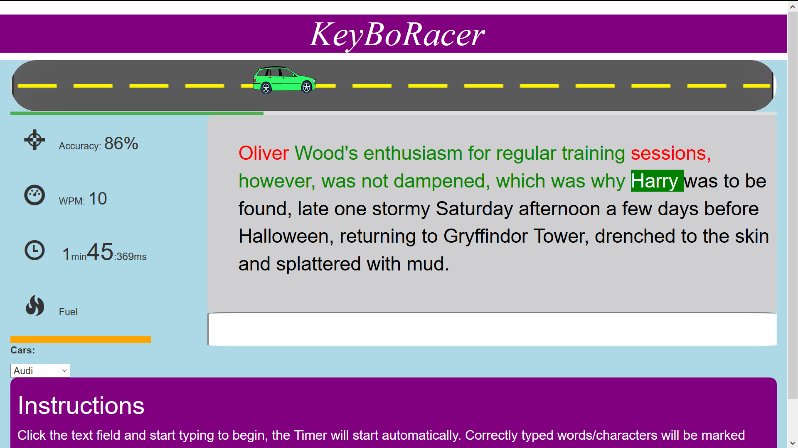

# KeyBoRacer

## Intro
A task was assigned to design and make a game using JS/jquery, CSS and HTML.

I have chosen to design a keyboard focused game for this task, it was one of my favourite type of game in my childhood.
## Main Features

- Live update of wpm (words per minute)
- Live update of Accuracy
- Clear indication of current word, correctly and Incorrectly typed words
- Timer
- Fuel penalty
- Car & fonts picker
- progression Bar and Car
- Input field clearance after pressing space or enter

## To be implemented
- Leader board
- UI enhancement

## How it works / Demo
Download the files. Make sure you open the site(index.html) using Firefox as it supports HttpRequests from local files, alternatively, you can try the game via my git-hub page : https://yunpx.github.io/KeyBoRacer/.
